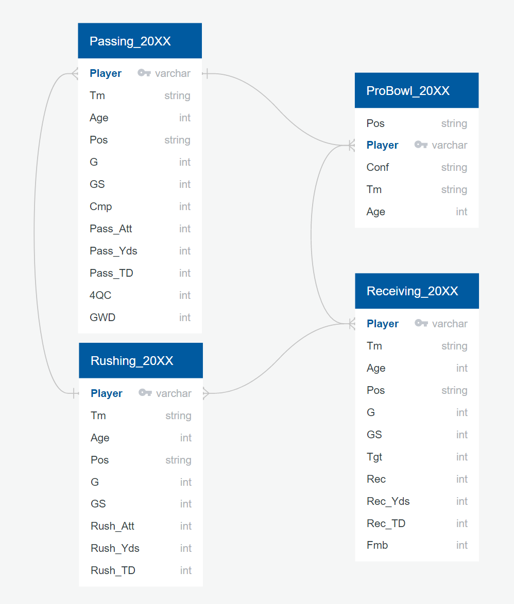

# NFL Pro Bowl Analysis

The Final Project for the [UT Data Analysis and Visualization Boot Camp](https://techbootcamps.utexas.edu/data/).

Group repository: https://github.com/krtuggey/ProBowl_Predictions

Contributors:
- https://github.com/patels250
- https://github.com/Bionicbabes
- https://github.com/krtuggey

## Communication Protocols
Our team communicated through Slack, Zoom, Text, and Github.

## Project Topic: NFL Pro Bowl Data Analysis
### Reason

During the initial phase of the project and project brainstorming, the team focused on topics that met certain criteria:
- Interesting context and marketable application
- The initial datasets were easily accessible and up to date
- The final project could be completed in a feasible amount of time
- Team members were comfortable with their roles within the project

The NFL Pro Bowl was chosen as the project focus because:
- The process is interesting and demonstrates the principles we have learned throughout the course
- The data available was vast and accessible
- A machine learning model can be applied effectively

## Source Data Overview

For this analysis, six sets of data from 2019 and 2020 were pulled, cleaned and combined to begin building a linear regression model. 
- 2019 source data: 
  - [2019 NFL Rushing](https://www.pro-football-reference.com/years/2019/rushing.htm)
  - [2019 NFL Passing](https://www.pro-football-reference.com/years/2019/passing.htm)
  - [2019 NFL Receiving](https://www.pro-football-reference.com/years/2019/receiving.htm)
  - [2019 NFL Pro Bowl](https://www.pro-football-reference.com/years/2019/probowl.htm)
- 2020 source data:
  - [2020 NFL Rushing](https://www.pro-football-reference.com/years/2020/rushing.htm)
  - [2020 NFL Passing](https://www.pro-football-reference.com/years/2020/passing.htm)
  - [2020 NFL Receiving](https://www.pro-football-reference.com/years/2020/receiving.htm)
  - [2020 NFL Pro Bowl](https://www.pro-football-reference.com/years/2020/probowl.htm)

The data can answer the question: "Can we use historical NFL statistics to effectively predict future Pro Bowl players?"

## Dataset

- Data downloaded from Pro Football Reference as .xlsx files
- Data processed and cleaned in Pandas
- Data exported as .csv files
- Data from .csv files loaded into PostgreSQL using pgAdmin4 and uploaded to AWS RDS

- 545 players in 2019, 561 players in 2020
- 22 variables
  - Player
  - Team
  - Age
  - Position
  - Games Played
  - Games Started
  - Pass Completions
  - Pass Attempts
  - Pass Yards
  - Pass Touchdowns
  - Interceptions
  - 4th Quarter Comebacks
  - Game Winning Drives
  - Rush Attempts
  - Rush Yards
  - Rush Touchdowns
  - Targets
  - Receptions
  - Receiving Yards
  - Receiving Touchdowns
  - Fumbles
  - Pro Bowl (True/False)

## Machine Learning Model

------------------------------------

**Summary**

- After investigating our data and understanding that our goal was to create a model that would be able to predict future outcome of a given data set we decided to choose the supervised machine learning logistic regression model.  In past experience we used sklearn on a single data set implementing the train_test_split function.  This function will take the data and randomly split the data into the test and train data sets but that is not what we wanted to do.  For our model we wanted to use the 2019 data set as our training model and 2020 data set as our testing model to see how well we are able to predict future pro bowl selections based on player statistics.  

**Preparign the Data**

## Presentation

[Google Slides Presentation](https://docs.google.com/presentation/d/1QMTFeos1eDaJR3Kg4zpU0v_xQqYuAL53f5qtuI3LXi4/edit?usp=sharing)

## Dashboards

[2019 Dashboard](https://public.tableau.com/app/profile/sagar.patel4941/viz/ProBowl2019/2019Dashboard)

[2020 Dashboard](https://public.tableau.com/app/profile/sagar.patel4941/viz/ProBowl2020/2020Dashboard)
